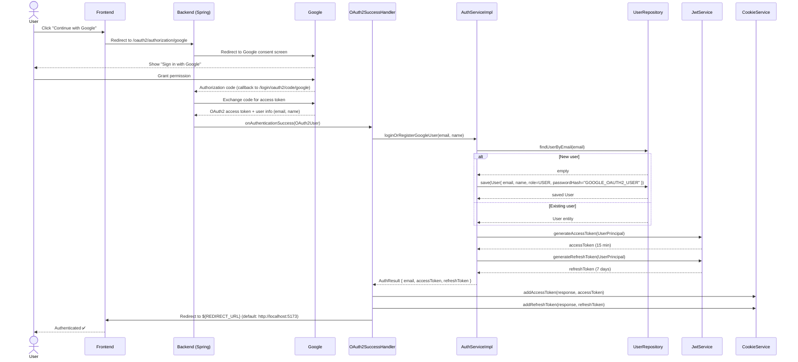

# Google OAuth 2.0

## Overview

Authentication via Google account using Spring Security OAuth2 Client. If the user signs in for the first time — they are automatically registered. On subsequent logins — they are simply authenticated.

## Flow



## How It Works

### 1. Frontend triggers the flow

```js
window.location.href = 'http://localhost:8081/oauth2/authorization/google'
```

This is not a regular API call — it is a full browser redirect. Spring Security intercepts this URL and handles everything from here.

### 2. Spring builds the Google authorization URL

Spring automatically constructs and redirects to:

```
https://accounts.google.com/o/oauth2/auth
  ?client_id=...
  &redirect_uri=http://localhost:8081/login/oauth2/code/google
  &scope=email profile
  &response_type=code
  &state=<random string>
```

The browser opens Google's "Sign in with Google" page. The backend does nothing at this point — it simply waits for the callback.

### 3. User grants permission on Google

Google shows the consent screen: "Verdora wants access to your email and profile". The user clicks "Allow".

### 4. Google sends the authorization code back

```
GET http://localhost:8081/login/oauth2/code/google
  ?code=4/P7q7W91...
  &state=<random string>
```

The `code` is a one-time Authorization Code. It is useless on its own — it must be exchanged for a token.

### 5. Spring exchanges the code for user info

Spring automatically makes a POST request to Google's token endpoint, receives an `access_token`, and then calls:

```
GET https://www.googleapis.com/oauth2/v2/userinfo
```

Google returns:
```json
{ "email": "user@gmail.com", "name": "Stepan Kovalenko", "picture": "..." }
```

**All of this is done by Spring Security automatically** — none of this code was written manually.

### 6. `OAuth2SuccessHandler` — where your code begins

```java
OAuth2User oauthUser = (OAuth2User) authentication.getPrincipal();
String email = oauthUser.getAttribute("email");
String name = oauthUser.getAttribute("name");

AuthResult result = authService.loginOrRegisterGoogleUser(email, name);
```

Spring calls this handler after a successful Google authentication, passing the user's data via `OAuth2User`.

### 7. Upsert logic — `loginOrRegisterGoogleUser`

```java
User user = userRepository.findUserByEmail(email)
    .orElseGet(() -> {
        User newUser = new User();
        newUser.setEmail(email);
        newUser.setName(name);
        newUser.setRole(Role.USER);
        newUser.setPasswordHash("GOOGLE_OAUTH2_USER"); // placeholder
        return userRepository.save(newUser);
    });
```

Two scenarios handled by one method:

- **First login** — user does not exist → create and save. `passwordHash = "GOOGLE_OAUTH2_USER"` is a placeholder that is never used for email/password login.
- **Returning user** — user already exists → just load them. Nothing is updated.

After that, `accessToken` and `refreshToken` are generated exactly the same way as in Sign In.

### 8. Cookies and redirect

```java
cookieService.addAccessToken(response, result.accessToken());
cookieService.addRefreshToken(response, result.refreshToken());
response.sendRedirect(oAuth2Properties.getRedirectUri()); // http://localhost:5173
```

The browser receives the cookies and is redirected to the frontend — the user is now authenticated.

### Why OAuth2 needs a session

```java
.sessionManagement(session -> session
    .sessionCreationPolicy(SessionCreationPolicy.IF_REQUIRED))
```

Unlike the JWT flow where no session is needed, OAuth2 **temporarily** uses a session to store the `state` parameter between steps (redirect to Google → callback from Google). This prevents CSRF attacks during the OAuth flow. Once authentication is complete, the session is no longer used.

## Configuration

**`application.yaml`**

```yaml
spring:
  security:
    oauth2:
      client:
        registration:
          google:
            client-id: ${GOOGLE_CLIENT_ID}
            client-secret: ${GOOGLE_CLIENT_SECRET}
            scope: [ email, profile ]

app:
  oauth2:
    redirect-uri: ${REDIRECT_URL:http://localhost:5173}
```

**`.env`**

```env
GOOGLE_CLIENT_ID=your_client_id
GOOGLE_CLIENT_SECRET=your_client_secret
REDIRECT_URL=http://localhost:5173
```

## Key Components

### `OAuth2SuccessHandler`

Called by Spring Security after successful Google authorization. Extracts `email` and `name` from `OAuth2User`, delegates business logic to `AuthService`, sets cookies, and redirects to the frontend.

### `AuthServiceImpl#loginOrRegisterGoogleUser`

```java
User user = userRepository.findUserByEmail(email)
    .orElseGet(() -> {
        User newUser = new User();
        newUser.setEmail(email);
        newUser.setName(name);
        newUser.setRole(Role.USER);
        newUser.setPasswordHash("GOOGLE_OAUTH2_USER"); // placeholder
        return userRepository.save(newUser);
    });
```

Upsert logic: find or create — a single method handles both scenarios.

### `SecurityConfig`

```java
.oauth2Login(oauth2 -> oauth2
    .successHandler(oAuth2SuccessHandler)
)
```

Public routes for the OAuth2 flow:

```java
.requestMatchers("/oauth2/**", "/login/oauth2/**").permitAll()
```

## Getting Client ID and Secret

1. Open [Google Cloud Console](https://console.cloud.google.com/)
2. Create a project → **APIs & Services** → **Credentials**
3. **Create Credentials** → **OAuth 2.0 Client IDs**
4. Application type: **Web application**
5. Authorized redirect URIs:
   ```
   http://localhost:8081/login/oauth2/code/google
   ```
6. Copy `Client ID` and `Client Secret` into `.env`
