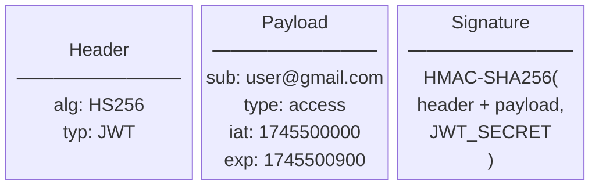
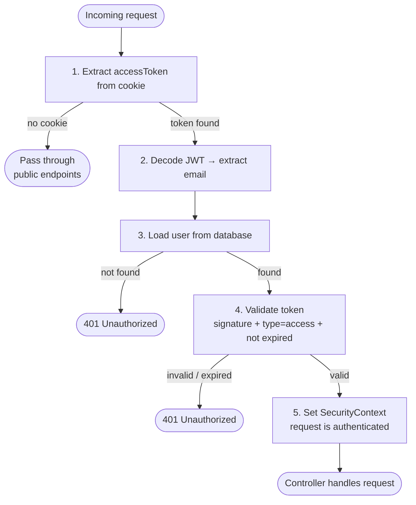
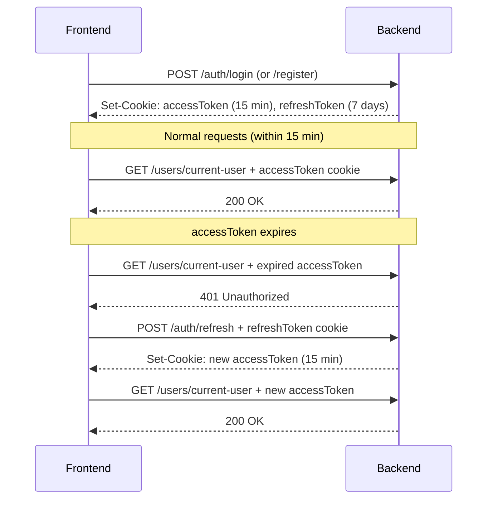

# JWT — JSON Web Token

## What is JWT

JWT (JSON Web Token) is an open standard for securely transmitting information between parties as a compact, self-contained string. The key property: the server does **not** store tokens anywhere. Instead, the token itself carries all the information needed to verify it — the server just checks the signature on every request.

---

## Token Structure

A JWT consists of three parts separated by dots:

```
header.payload.signature
```

Real example:
```
eyJhbGciOiJIUzI1NiJ9.eyJzdWIiOiJ1c2VyQGdtYWlsLmNvbSIsInR5cGUiOiJhY2Nlc3MiLCJpYXQiOjE3NDU1MDAwMDAsImV4cCI6MTc0NTUwMDkwMH0.abc123...
```

Each part is Base64URL encoded — **not encrypted**, just encoded. Anyone can decode the header and payload. The signature is what makes it secure.



### Header

```json
{
  "alg": "HS256",
  "typ": "JWT"
}
```

Describes the algorithm used to sign the token. `HS256` = HMAC + SHA-256.

### Payload (Claims)

```json
{
  "sub": "user@gmail.com",
  "type": "access",
  "iat": 1745500000,
  "exp": 1745500900
}
```

| Field | Name | Description |
|---|---|---|
| `sub` | Subject | Who the token belongs to — in this project: email |
| `type` | Custom claim | `"access"` or `"refresh"` — distinguishes token types |
| `iat` | Issued At | Unix timestamp when the token was issued |
| `exp` | Expiration | Unix timestamp when the token expires |

### Signature

```
HMAC-SHA256(
  base64url(header) + "." + base64url(payload),
  secret
)
```

The signature is computed using the secret key (`JWT_SECRET`). If anyone tampers with the payload — even changes one character — the signature becomes invalid and the token is rejected.

---

## How It Works in This Project

### Token generation — `JwtService`

```java
public String generateAccessToken(UserDetails userDetails) {
    return Jwts.builder()
            .setSubject(userDetails.getUsername())   // email
            .claim("type", "access")
            .setIssuedAt(new Date())
            .setExpiration(new Date(System.currentTimeMillis() + jwtProperties.getAccessExpirationMs()))
            .signWith(getSecretKey())
            .compact();
}
```

```java
private SecretKey getSecretKey() {
    return Keys.hmacShaKeyFor(jwtProperties.getSecret().getBytes(StandardCharsets.UTF_8));
}
```

The secret key is loaded from `JWT_SECRET` in `.env` via `JwtProperties` (`@ConfigurationProperties(prefix = "app.jwt")`). The token is signed with HMAC-SHA and returned as a compact string.

### Two token types

| | `accessToken` | `refreshToken` |
|---|---|---|
| `type` claim | `"access"` | `"refresh"` |
| Expiration | 15 minutes | 7 days |
| Purpose | Authorizes API requests | Issues new `accessToken` |
| Cookie path | `/` | `/auth/refresh` |

The `type` claim prevents using a `refreshToken` as an `accessToken` and vice versa — validated explicitly in `isAccessTokenValid` and `isRefreshTokenValid`.

### Storage — `CookieService`

Tokens are stored in `HttpOnly` cookies, not in `localStorage` or memory:

```java
Cookie cookie = new Cookie("accessToken", token);
cookie.setHttpOnly(true);   // JavaScript cannot read this cookie — XSS protection
cookie.setSecure(false);    // true in production (HTTPS only)
cookie.setPath("/");
cookie.setMaxAge(60 * 60);  // 1 hour in browser, token itself expires in 15 min
```

The `refreshToken` has a restricted path:
```java
cookie.setPath("/auth/refresh");
```
This means the browser only sends `refreshToken` when calling `/auth/refresh` — it does not travel with every request.

### Validating every request — `JwtAuthenticationFilter`

This filter runs on every incoming request, before it reaches any controller:

```java
String token = extractTokenFromCookies(request);   // 1. read accessToken cookie
if (token == null) {
    filterChain.doFilter(request, response);         // no token — pass through (public endpoints)
    return;
}

String email = jwtService.extractUsername(token);   // 2. decode JWT, extract email from "sub"

if (email != null && SecurityContextHolder.getContext().getAuthentication() == null) {
    UserDetails userDetails = userDetailsService.loadUserByUsername(email); // 3. load user from DB
    if (jwtService.isAccessTokenValid(token, userDetails)) {                // 4. validate token
        UsernamePasswordAuthenticationToken authToken = new UsernamePasswordAuthenticationToken(
            userDetails, null, userDetails.getAuthorities()
        );
        SecurityContextHolder.getContext().setAuthentication(authToken);    // 5. mark as authenticated
    }
}
filterChain.doFilter(request, response);             // 6. continue to controller
```



Step by step:
1. Extract `accessToken` from cookies
2. Decode the JWT and get the email from `sub` claim
3. Load the user from the database (verifies the user still exists)
4. Check that the token signature is valid and `type` equals `"access"`
5. Set authentication in `SecurityContext` — Spring Security now knows who is making the request
6. Pass to the next filter / controller

### Token validation — `isAccessTokenValid`

```java
public boolean isAccessTokenValid(String token, UserDetails userDetails) {
    Claims claims = extractAllClaims(token); // throws TokenExpiredException or InvalidTokenException
    return userDetails.getUsername().equals(claims.getSubject())
            && "access".equals(claims.get("type", String.class));
}
```

`extractAllClaims` uses the secret key to parse and verify the signature. If the token is expired — `ExpiredJwtException` is caught and rethrown as `TokenExpiredException`. If tampered — `JwtException` → `InvalidTokenException`.

---

## Token Refresh Flow

When `accessToken` expires (after 15 minutes), the frontend calls `POST /auth/refresh`. The `refreshToken` cookie is sent automatically:

```java
public String refresh(String refreshToken) {
    if (refreshToken == null) throw new InvalidTokenException();
    if (!jwtService.isRefreshToken(refreshToken)) throw new WrongTokenTypeException();  // type check

    String email = jwtService.extractUsername(refreshToken);
    UserDetails userDetails = userDetailsService.loadUserByUsername(email);

    if (!jwtService.isRefreshTokenValid(refreshToken, userDetails)) throw new InvalidTokenException();

    return jwtService.generateAccessToken(userDetails);  // new accessToken, same refreshToken
}
```



The `refreshToken` is not rotated — the same one is reused until it expires (7 days). In production this is a security consideration worth addressing (see Future Improvements in README).

---

## Stateless vs Stateful

Traditional session-based auth stores session data on the server and gives the client only a session ID. JWT is stateless — the server stores nothing. Every token is self-contained.

| | Session-based | JWT (this project) |
|---|---|---|
| Server stores | Session in DB/memory | Nothing |
| Token contains | Just an ID | All data + signature |
| Revocation | Delete session from DB | Not possible without a blocklist |
| Scaling | Shared session store needed | Works across multiple instances |

The tradeoff: because tokens are stateless, they **cannot be revoked** before expiration. If an `accessToken` is compromised, it remains valid for up to 15 minutes. This is why short expiration times matter.

---

## Configuration

```yaml
app:
  jwt:
    secret: ${JWT_SECRET}
    access-expiration-ms: 900000    # 15 min
    refresh-expiration-ms: 604800000 # 7 days
```

Bound to `JwtProperties` via `@ConfigurationProperties(prefix = "app.jwt")`.

The secret must be at least 256 bits (32 characters) for HMAC-SHA256. Generate a new one for production:

```bash
openssl rand -base64 32
```

---

## Components Overview

| Class | Role |
|---|---|
| `JwtService` | Generates and validates tokens |
| `JwtProperties` | Binds `app.jwt.*` config properties |
| `JwtAuthenticationFilter` | Intercepts every request, validates `accessToken` |
| `CookieService` | Sets, reads, and clears `HttpOnly` cookies |
| `UserPrincipal` | Wraps `User` entity, implements `UserDetails` |
