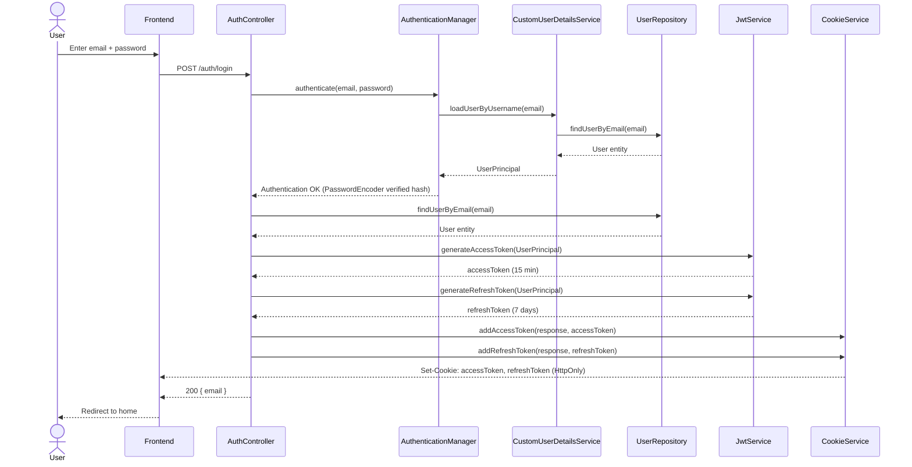

# Sign In

## Overview

Standard email/password authentication. Upon success, two `HttpOnly` cookies are set — `accessToken` and `refreshToken`.

## Endpoint

```
POST /auth/login
Content-Type: application/json
```

### Request body

```json
{
  "email": "user@gmail.com",
  "password": "12345678"
}
```

### Success response `200`

```json
{
  "timestamp": "2026-04-21T13:55:49.772Z",
  "status": 200,
  "message": "Login successful",
  "data": {
    "email": "user@gmail.com"
  }
}
```

Cookies set automatically:

| Cookie | HttpOnly | Path | Max-Age |
|---|---|---|---|
| `accessToken` | ✅ | `/` | 1 hour |
| `refreshToken` | ✅ | `/auth/refresh` | 7 days |

### Error response `401`

```json
{
  "timestamp": "2026-04-21T13:55:49.773Z",
  "status": 401,
  "message": "Invalid email or password",
  "data": null
}
```

## Flow



## How It Works

### 1. Request arrives at `AuthController`

The request hits `AuthController.login()`. Unlike `/register`, there is **no `@Valid` annotation** here — format validation of email and password does not happen at this stage. If an empty string is passed, it will simply proceed and fail at the authentication level.

### 2. `AuthenticationManager` — the core of the flow

```java
authenticationManager.authenticate(
    new UsernamePasswordAuthenticationToken(request.email(), request.password())
);
```

This single line triggers a full internal chain:

`AuthenticationManager` → delegates to `DaoAuthenticationProvider` → calls `CustomUserDetailsService.loadUserByUsername(email)` → loads the user from the database and returns a `UserPrincipal` → `DaoAuthenticationProvider` takes `getPassword()` from `UserPrincipal` (the BCrypt hash) and uses `PasswordEncoder.matches(rawPassword, hash)` to compare it with the incoming password.

If the password does not match — `BadCredentialsException` is thrown, caught by `GlobalExceptionHandler`, and a `401` is returned.

### 3. Second database call

```java
User user = userRepository.findUserByEmail(request.email())
        .orElseThrow(InvalidCredentialsException::new);
```

Even though `CustomUserDetailsService` already fetched the user during authentication, that result is not reused here. `AuthenticationManager.authenticate()` returns an `Authentication` object that we don't store, so we fetch the `User` entity again to build a `UserPrincipal` for token generation.

### 4. JWT token generation

```java
String accessToken = jwtService.generateAccessToken(new UserPrincipal(user));
String refreshToken = jwtService.generateRefreshToken(new UserPrincipal(user));
```

Each token is a signed JWT with the following payload:

```
{
  "sub": "user@gmail.com",
  "type": "access" | "refresh",
  "iat": <issued at>,
  "exp": <expiration>
}
```

Signed with HMAC-SHA using the `JWT_SECRET` key.

### 5. Cookies

Two `HttpOnly` cookies are set on the response:

- **`accessToken`** — path `/`, expires in 1 hour. Sent automatically with every request to the backend.
- **`refreshToken`** — path `/auth/refresh`, expires in 7 days. Only sent when the frontend explicitly calls `/auth/refresh`, not on every request.

`HttpOnly` means JavaScript cannot read these cookies — protection against XSS attacks.

### 6. How the token protects subsequent requests — `JwtAuthenticationFilter`

After login, every request to a protected endpoint passes through this filter:

```java
String token = extractTokenFromCookies(request); // reads accessToken from cookie
String email = jwtService.extractUsername(token); // decodes JWT, extracts email
UserDetails userDetails = userDetailsService.loadUserByUsername(email); // hits the DB
if (jwtService.isAccessTokenValid(token, userDetails)) {
    SecurityContextHolder.getContext().setAuthentication(...); // marks request as authenticated
}
```

On every request: the JWT is decoded, the user is loaded from the database, and the token type (`"access"`) and signature are validated. Only then does Spring Security allow the request through to the protected endpoint.

## Token Refresh

When `accessToken` expires, the frontend calls:

```
POST /auth/refresh
```

The `refreshToken` is sent automatically via cookie. The backend validates its type (`"type": "refresh"`), extracts the email, and issues a new `accessToken`.

## Logout

```
POST /auth/logout
```

Both cookies are cleared (MaxAge = 0).
