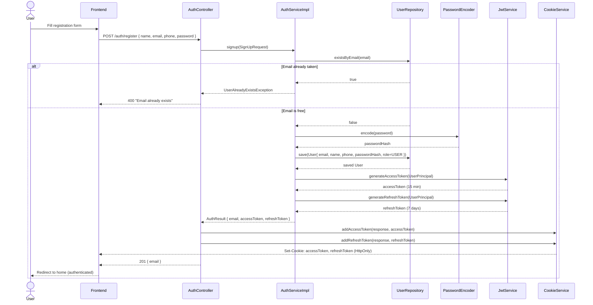

# Sign Up

## Overview

Registers a new user. Upon successful registration the user is immediately authenticated — `accessToken` and `refreshToken` cookies are set, so a separate login step is not required.

## Endpoint

```
POST /auth/register
Content-Type: application/json
```

### Request body

```json
{
  "name": "Stepan",
  "email": "user@gmail.com",
  "phone": "+380989703417",
  "password": "12345678"
}
```

| Field | Required | Validation |
|---|---|---|
| `name` | ✅ | — |
| `email` | ✅ | valid email format |
| `phone` | ❌ | `+?[0-9]{7,15}` |
| `password` | ✅ | 8–20 characters |

### Success response `201`

```json
{
  "timestamp": "2026-04-21T13:55:49.772Z",
  "status": 201,
  "message": "User created",
  "data": {
    "email": "user@gmail.com"
  }
}
```

Cookies set automatically:

| Cookie | HttpOnly | Path | Max-Age |
|---|---|---|---|
| `accessToken` | ✅ | `/` | 1 hour |
| `refreshToken` | ✅ | `/auth/refresh` | 7 days |

### Error response `400`

```json
{
  "timestamp": "2026-04-21T13:55:49.773Z",
  "status": 400,
  "message": "Email already exists",
  "data": null
}
```

## Flow



## How It Works

### 1. Validation at the controller level

```java
@PostMapping("/register")
public ResponseEntity<...> signup(@Valid @RequestBody SignUpRequest request, ...)
```

`@Valid` triggers Spring's bean validation before the method body even runs. If `password` is shorter than 8 characters or `email` has an invalid format — Spring immediately returns `400` without entering the method.

### 2. Duplicate email check

```java
if (userRepository.existsByEmail(request.email())) {
    throw new UserAlreadyExistsException();
}
```

A single query to the database to check if this email is already taken. If it is — an exception is thrown, caught by `GlobalExceptionHandler`, and a `400` is returned. This check happens before any other work to avoid unnecessary processing.

### 3. Mapping the request to an entity

```java
User user = userMapper.toEntity(request);
```

`UserMapper` (MapStruct) converts `SignUpRequest` → `User` entity, copying `name`, `email`, and `phone`. MapStruct generates this code at compile time — no reflection, no manual field-by-field assignment.

### 4. Password hashing

```java
user.setPasswordHash(passwordEncoder.encode(request.password()));
```

BCrypt transforms `"12345678"` into something like `"$2a$10$xJwL5v..."`. Only the **hash** is stored in the database — the raw password is never persisted. BCrypt is a one-way function, meaning the original password cannot be recovered from the hash.

### 5. Saving the user

```java
user.setRole(Role.USER);
userRepository.save(user);
```

JPA persists the user to the `users` table. The `@PrePersist` lifecycle hook automatically sets `createdAt` and `updatedAt` to the current UTC time before the insert.

### 6. Token generation and cookies

```java
UserPrincipal principal = new UserPrincipal(user);
String accessToken = jwtService.generateAccessToken(principal);
String refreshToken = jwtService.generateRefreshToken(principal);
```

`UserPrincipal` is a wrapper around `User` that implements Spring Security's `UserDetails` interface. `JwtService` signs a JWT with `subject = email`, `type = "access"/"refresh"`, and an expiration time. Both tokens are then written to `HttpOnly` cookies on the response — the user is authenticated immediately after registration.

### Key difference from Sign In

Sign Up does not use `AuthenticationManager`. There are no credentials to verify — we create the user ourselves, hash the password, and issue tokens directly. Sign In, on the other hand, delegates credential verification entirely to Spring Security.

## User Entity

```java
User {
  id          Long          // auto-generated
  name        String        // max 256 chars
  email       String        // unique, max 256 chars
  phoneNumber String        // optional, +7-15 digits
  passwordHash String       // BCrypt hash
  role        Role          // USER (default)
  createdAt   OffsetDateTime
  updatedAt   OffsetDateTime
}
```

> Google OAuth users are registered with `passwordHash = "GOOGLE_OAUTH2_USER"` — they cannot log in via the email/password form.
