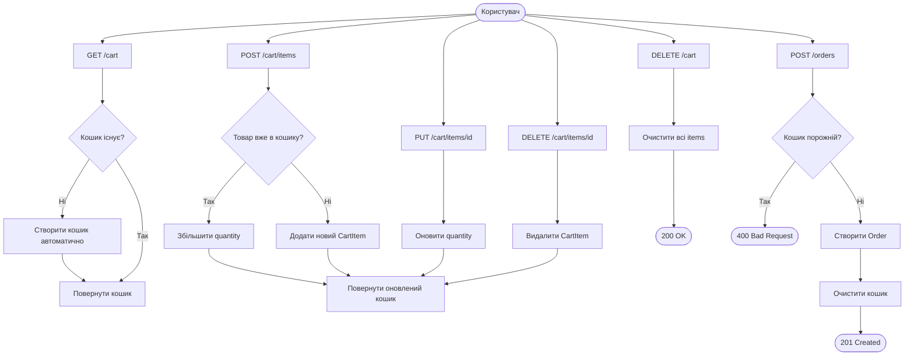
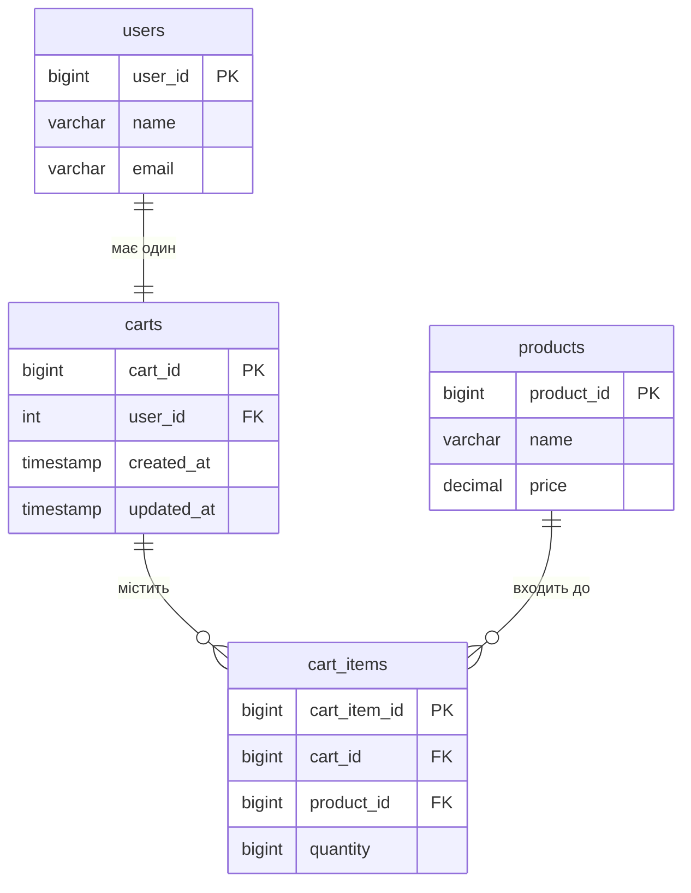

# Cart API

Кошик прив'язаний до конкретного користувача (1 user = 1 cart). Створюється автоматично при першому зверненні.

---

## Ендпоінти

| Метод | URL | Опис |
|---|---|---|
| GET | `/cart` | Отримати кошик |
| POST | `/cart/items` | Додати товар |
| PUT | `/cart/items/{cartItemId}` | Змінити кількість |
| DELETE | `/cart/items/{cartItemId}` | Видалити товар |
| DELETE | `/cart` | Очистити кошик |

Всі ендпоінти потребують автентифікації (`accessToken` cookie).

---

## GET /cart

Повертає поточний кошик з усіма товарами і загальною сумою.

**Response 200:**
```json
{
  "timestamp": "2026-05-23T12:00:00Z",
  "status": 200,
  "message": "Cart fetched successfully",
  "data": {
    "cartId": 1,
    "items": [
      {
        "cartItemId": 1,
        "productId": 1,
        "productName": "Ноутбук ASUS VivoBook 15",
        "imageUrl": "https://picsum.photos/seed/p1/400/300",
        "price": 32999.99,
        "quantity": 2,
        "subtotal": 65999.98
      }
    ],
    "totalPrice": 65999.98
  }
}
```

---

## POST /cart/items

Додає товар до кошика. Якщо товар вже є — збільшує кількість.

**Request body:**
```json
{
  "productId": 1,
  "quantity": 2
}
```

**Валідація:**
- `productId` — обов'язкове
- `quantity` — обов'язкове, більше 0

**Response 200** — повертає оновлений кошик (структура як у GET /cart)

**Response 404** — товар не знайдено:
```json
{
  "status": 404,
  "message": "Product not found, id=99"
}
```

---

## PUT /cart/items/{cartItemId}

Змінює кількість конкретного товару в кошику.

**Request body:**
```json
{
  "quantity": 5
}
```

**Валідація:**
- `quantity` — обов'язкове, більше 0

**Response 200** — повертає оновлений кошик

**Response 404** — елемент кошика не знайдено:
```json
{
  "status": 404,
  "message": "Cart item not found, id=99"
}
```

---

## DELETE /cart/items/{cartItemId}

Видаляє конкретний товар з кошика.

**Response 200** — повертає оновлений кошик

**Response 404** — елемент кошика не знайдено

---

## DELETE /cart

Очищає весь кошик (видаляє всі товари).

**Response 200:**
```json
{
  "status": 200,
  "message": "Cart cleared successfully",
  "data": null
}
```

---

## Структура відповіді

### CartResponse
| Поле | Тип | Опис |
|---|---|---|
| `cartId` | Long | ID кошика |
| `items` | List | Список товарів |
| `totalPrice` | BigDecimal | Загальна сума |

### CartItemResponse
| Поле | Тип | Опис |
|---|---|---|
| `cartItemId` | Long | ID елемента кошика |
| `productId` | Long | ID товару |
| `productName` | String | Назва товару |
| `imageUrl` | String | URL зображення |
| `price` | BigDecimal | Поточна ціна товару |
| `quantity` | Long | Кількість |
| `subtotal` | BigDecimal | price × quantity |

---

## Бізнес-логіка

- Кошик створюється **автоматично** при першому зверненні до `/cart`
- Якщо додати товар який вже є в кошику — **quantity збільшується**, новий рядок не створюється
- `subtotal` і `totalPrice` розраховуються **динамічно** при кожному запиті
- При оформленні замовлення (`POST /orders`) кошик **очищається автоматично**
- Один юзер = один кошик (обмежено на рівні БД через `UNIQUE`)

---

## Діаграма флоу



## Діаграма БД


