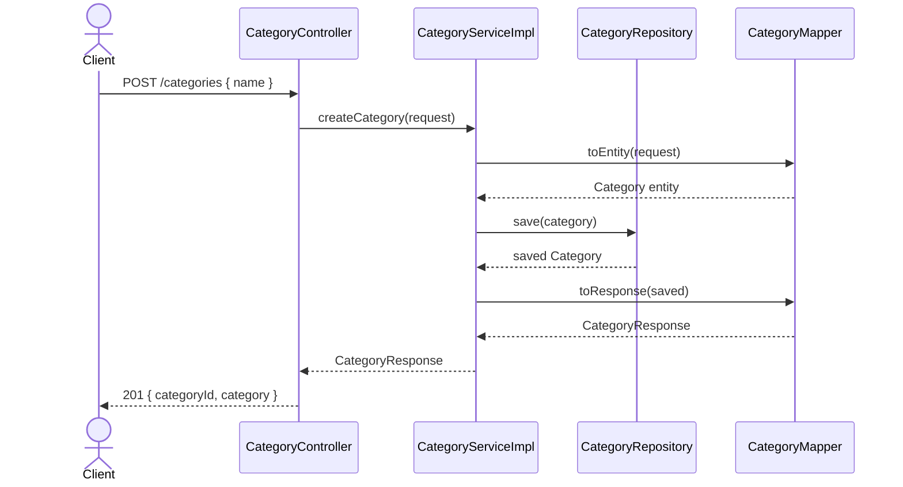

# Categories

## Overview

CRUD endpoints for managing product categories. All endpoints are public (no authentication required).

## Entity

```java
Category {
  id    Long    // auto-generated
  name  String  // max 256 chars, required
}
```

Database table: `categories`

```sql
CREATE TABLE categories (
    category_id BIGINT GENERATED ALWAYS AS IDENTITY PRIMARY KEY,
    name        VARCHAR(256) NOT NULL
);
```

## Endpoints

| Method | Endpoint | Description | Auth |
|---|---|---|---|
| POST | `/categories` | Create category | ❌ |
| PUT | `/categories/{id}` | Update category | ❌ |
| DELETE | `/categories/{id}` | Delete category | ❌ |

---

### POST `/categories` — Create

**Request body**

```json
{
  "name": "Electronics"
}
```

| Field | Required | Validation |
|---|---|---|
| `name` | ✅ | not blank, max 256 chars |

**Success response `201`**

```json
{
  "timestamp": "2026-04-26T12:00:00Z",
  "status": 201,
  "message": "Category created",
  "data": {
    "categoryId": "1",
    "category": "Electronics"
  }
}
```

---

### PUT `/categories/{id}` — Update

**Path variable:** `id` — category ID

**Request body**

```json
{
  "name": "Home Appliances"
}
```

**Success response `200`**

```json
{
  "timestamp": "2026-04-26T12:00:00Z",
  "status": 200,
  "message": "Category updated",
  "data": {
    "categoryId": "1",
    "category": "Home Appliances"
  }
}
```

**Error response `404`**

```json
{
  "timestamp": "2026-04-26T12:00:00Z",
  "status": 404,
  "message": "Category with id 1 not found",
  "data": null
}
```

---

### DELETE `/categories/{id}` — Delete

**Path variable:** `id` — category ID

**Success response `200`**

```json
{
  "timestamp": "2026-04-26T12:00:00Z",
  "status": 200,
  "message": "Category deleted successfully",
  "data": null
}
```

**Error response `404`**

```json
{
  "timestamp": "2026-04-26T12:00:00Z",
  "status": 404,
  "message": "Category with id 1 not found",
  "data": null
}
```

---

## Flow



## Key Components

### `CategoryMapper`

MapStruct mapper — converts between `CategoryRequest` → `Category` entity → `CategoryResponse`. No manual mapping needed.

### `CategoryServiceImpl#getByIdOrThrow`

Reusable private method used by both `updateCategory` and `deleteCategory`:

```java
private Category getByIdOrThrow(Long id) {
    return categoryRepository.findById(id)
            .orElseThrow(() -> new CategoryNotFoundException(id));
}
```

If category is not found — throws `CategoryNotFoundException`, which is handled by `GlobalExceptionHandler` and returns `404`.
