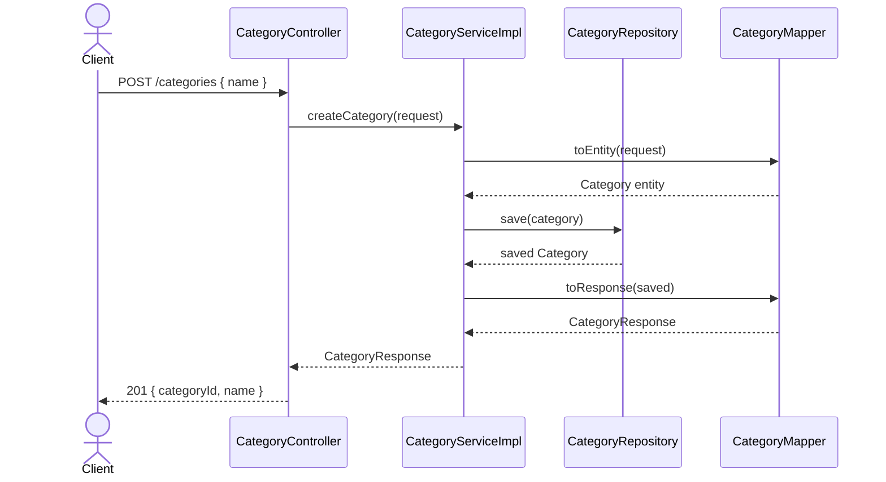

# Categories

## Overview

CRUD endpoints for managing product categories.

Read operations are public.

Create, update, and delete operations require the `ADMIN` role.

## Entity

```java
Category {
    id    Long    // auto-generated
    name  String  // max 256 chars, required
}
```

Database table: `categories`

```sql
CREATE TABLE categories (
    category_id BIGINT GENERATED ALWAYS AS IDENTITY PRIMARY KEY,
    name        VARCHAR(256) NOT NULL
);
```

## Endpoints

| Method | Endpoint | Description | Auth |
|---|---|---|---|
| GET | `/categories` | Get all categories | Public |
| GET | `/categories/{id}` | Get category by ID | Public |
| POST | `/categories` | Create category | ADMIN |
| PUT | `/categories/{id}` | Update category | ADMIN |
| DELETE | `/categories/{id}` | Delete category | ADMIN |

---

### GET `/categories` — Get all categories

Returns categories with pagination.

Default page size: `12`.

Default sorting: `id`.

Example:

```text
GET /categories?page=0&size=12&sort=id
```

**Success response `200`**

```json
{
  "timestamp": "2026-04-26T12:00:00Z",
  "status": 200,
  "message": "Categories fetched successfully",
  "data": {
    "content": [
      {
        "categoryId": 1,
        "name": "Electronics"
      }
    ],
    "page": {
      "size": 12,
      "number": 0,
      "totalElements": 1,
      "totalPages": 1
    }
  }
}
```

---

### GET `/categories/{id}` — Get by ID

**Path variable:** `id` — category ID

**Success response `200`**

```json
{
  "timestamp": "2026-04-26T12:00:00Z",
  "status": 200,
  "message": "Category fetched successfully",
  "data": {
    "categoryId": 1,
    "name": "Electronics"
  }
}
```

**Error response `404`**

```json
{
  "timestamp": "2026-04-26T12:00:00Z",
  "status": 404,
  "message": "Category with id 1 not found",
  "data": null
}
```

---

### POST `/categories` — Create

Requires authentication with the `ADMIN` role.

**Request body**

```json
{
  "name": "Electronics"
}
```

| Field | Required | Validation |
|---|---|---|
| `name` | ✅ | not blank, max 256 chars |

**Success response `201`**

```json
{
  "timestamp": "2026-04-26T12:00:00Z",
  "status": 201,
  "message": "Category created",
  "data": {
    "categoryId": 1,
    "name": "Electronics"
  }
}
```

**Error response `403`**

Returned when the authenticated user does not have the `ADMIN` role.

---

### PUT `/categories/{id}` — Update

Requires authentication with the `ADMIN` role.

**Path variable:** `id` — category ID

**Request body**

```json
{
  "name": "Home Appliances"
}
```

**Success response `200`**

```json
{
  "timestamp": "2026-04-26T12:00:00Z",
  "status": 200,
  "message": "Category updated",
  "data": {
    "categoryId": 1,
    "name": "Home Appliances"
  }
}
```

**Error response `404`**

```json
{
  "timestamp": "2026-04-26T12:00:00Z",
  "status": 404,
  "message": "Category with id 1 not found",
  "data": null
}
```

**Error response `403`**

Returned when the authenticated user does not have the `ADMIN` role.

---

### DELETE `/categories/{id}` — Delete

Requires authentication with the `ADMIN` role.

**Path variable:** `id` — category ID

**Success response `200`**

```json
{
  "timestamp": "2026-04-26T12:00:00Z",
  "status": 200,
  "message": "Category deleted successfully",
  "data": null
}
```

**Error response `404`**

```json
{
  "timestamp": "2026-04-26T12:00:00Z",
  "status": 404,
  "message": "Category with id 1 not found",
  "data": null
}
```

**Error response `403`**

Returned when the authenticated user does not have the `ADMIN` role.

---

## Authorization

The following endpoints are public:

```text
GET /categories
GET /categories/{id}
```

The following endpoints require the `ADMIN` role:

```text
POST /categories
PUT /categories/{id}
DELETE /categories/{id}
```

Authorization is enforced with:

```java
@PreAuthorize("hasRole('ADMIN')")
```

Protected endpoints use cookie-based authentication.

---

## Flow


```mermaid
sequenceDiagram
    actor Client
    participant CategoryController
    participant CategoryServiceImpl
    participant CategoryRepository
    participant CategoryMapper

    Client->>CategoryController: POST /categories { name }

    CategoryController->>CategoryServiceImpl: createCategory(request)
    CategoryServiceImpl->>CategoryMapper: toEntity(request)
    CategoryMapper-->>CategoryServiceImpl: Category entity
    CategoryServiceImpl->>CategoryRepository: save(category)
    CategoryRepository-->>CategoryServiceImpl: saved Category
    CategoryServiceImpl->>CategoryMapper: toResponse(saved)
    CategoryMapper-->>CategoryServiceImpl: CategoryResponse
    CategoryServiceImpl-->>CategoryController: CategoryResponse
    CategoryController-->>Client: 201 { categoryId, name }
```

## Key Components

### `CategoryMapper`

MapStruct mapper that converts between `CategoryRequest`, `Category`, and `CategoryResponse`.

```text
CategoryRequest → Category → CategoryResponse
```

### `CategoryServiceImpl#getByIdOrThrow`

Reusable private method used when a category must exist before an operation is performed.

```java
private Category getByIdOrThrow(Long id) {
    return categoryRepository.findById(id)
            .orElseThrow(() -> new CategoryNotFoundException(id));
}
```

If the category is not found, `CategoryNotFoundException` is thrown.

`GlobalExceptionHandler` handles the exception and returns HTTP `404`.