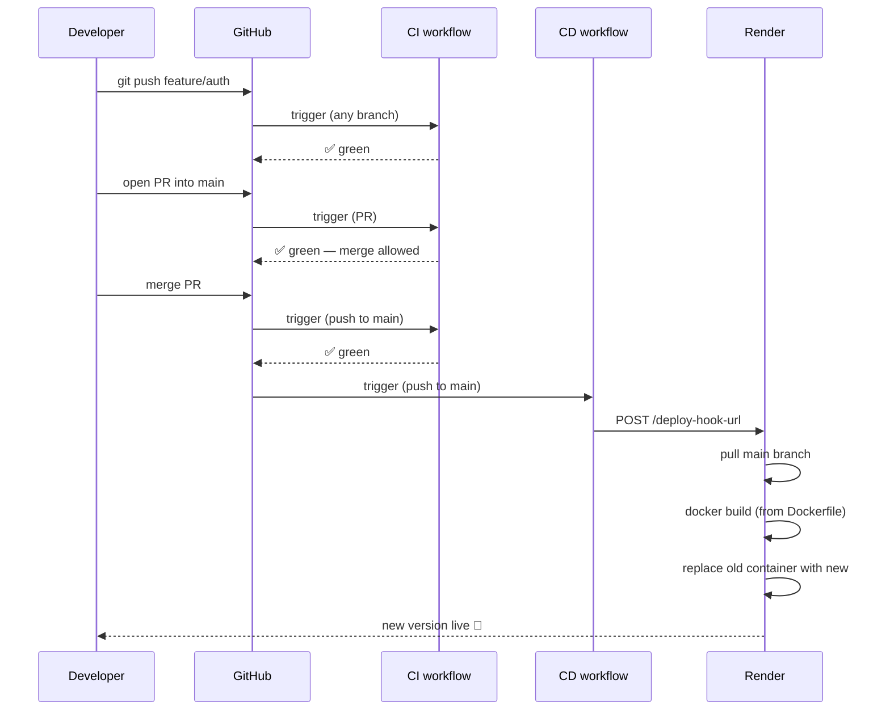
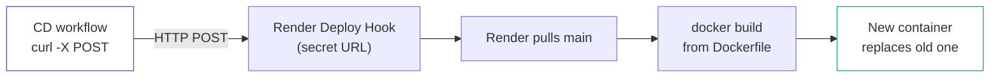
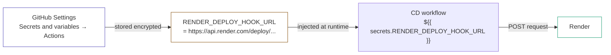
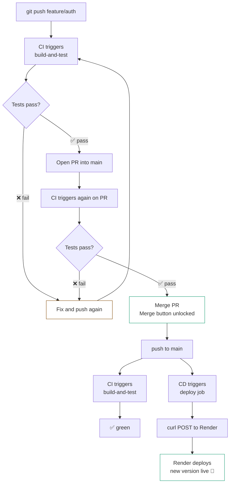
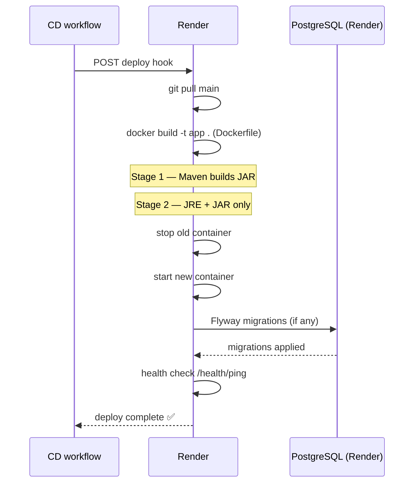

# GitHub Actions — CD

## What is CD

**CD (Continuous Deployment)** — automatically deploys code to production after every merge into `main`. No manual steps — merge happens, and within minutes the new version is live on the server.

**Why it matters:**
- No manual deploys — less human error
- Every merge to `main` is immediately live
- Clear, auditable deploy history in GitHub Actions

---

## How It Works with Render



---

## Deploy Hook — How Render Deploys

Render provides a **Deploy Hook** — a private URL. When you make a `POST` request to it — Render pulls the latest code from `main`, builds the Docker image, and replaces the running container.



**Why Deploy Hook instead of Render's Auto-Deploy?**

Render has a built-in Auto-Deploy feature that triggers on every push to `main`. But using a Deploy Hook via GitHub Actions gives you full control:

| | Auto-Deploy (Render) | Deploy Hook (CD workflow) |
|---|---|---|
| Trigger | Every push to `main` | Controlled by GitHub Actions |
| CI must pass first | ❌ deploys regardless | ✅ CD only runs after CI passes |
| Visibility | Render dashboard only | GitHub Actions + Render dashboard |
| Control | Limited | Full |

With Auto-Deploy disabled and CD workflow enabled — Render only deploys when GitHub explicitly tells it to, after CI has already passed.

---

## Workflow File — `cd.yml`

```yaml
name: CD

on:
  push:
    branches:
      - main

jobs:
  deploy:
    runs-on: ubuntu-latest

    steps:
      - name: Trigger Render Deploy
        run: |
          curl -X POST "${{ secrets.RENDER_DEPLOY_HOOK_URL }}"
```

---

## Line by Line

```yaml
on:
  push:
    branches:
      - main
```

Triggers only on push to `main` — which happens after a PR is merged. Does not trigger on feature branches.

```yaml
jobs:
  deploy:
    runs-on: ubuntu-latest
```

Single job called `deploy`. GitHub spins up a clean Ubuntu machine.

```yaml
- name: Trigger Render Deploy
  run: |
    curl -X POST "${{ secrets.RENDER_DEPLOY_HOOK_URL }}"
```

`curl -X POST` — makes an HTTP POST request to the Render Deploy Hook URL.

`${{ secrets.RENDER_DEPLOY_HOOK_URL }}` — GitHub Actions reads the secret value. It never appears in logs — GitHub masks it automatically.

That's it. The entire CD workflow is one `curl` command. Render handles the rest.

---

## GitHub Secrets — How They Work

Secrets are encrypted values stored in GitHub — never exposed in logs or code.



**How to add a secret:**

Repository → Settings → Secrets and variables → Actions → **New repository secret**

```
Name:  RENDER_DEPLOY_HOOK_URL
Value: https://api.render.com/deploy/srv-xxx?key=yyy
```

The value is write-only — once saved, no one can read it, only use it in workflows.

---

## Full CI + CD Flow



---

## Render — What Happens During Deploy



---

## Setup Checklist

```
✅ Render Web Service created (Docker runtime, main branch)
✅ Auto-Deploy disabled in Render Settings → Deploy
✅ Deploy Hook URL copied from Render Settings → Deploy
✅ RENDER_DEPLOY_HOOK_URL added to GitHub Secrets
✅ .github/workflows/cd.yml created and pushed
✅ All environment variables set in Render → Environment
```

---

## File Location

```
Verdora-backend/
├── .github/
│   └── workflows/
│       ├── ci.yml    ← runs on every push + PR
│       └── cd.yml    ← runs only on push to main
├── src/
├── Dockerfile
├── docker-compose.yml
└── pom.xml
```

---

## Render Free Plan — Things to Know

| Limitation | Details |
|---|---|
| Sleep after inactivity | Service spins down after 15 min of no requests |
| Cold start | First request after sleep takes ~30-60 seconds |
| PostgreSQL | Free DB is deleted after 90 days |
| Deploy time | ~5-10 min (Docker build from scratch) |

For a pet project and portfolio — completely fine. The cold start is noticeable but acceptable for demos.
