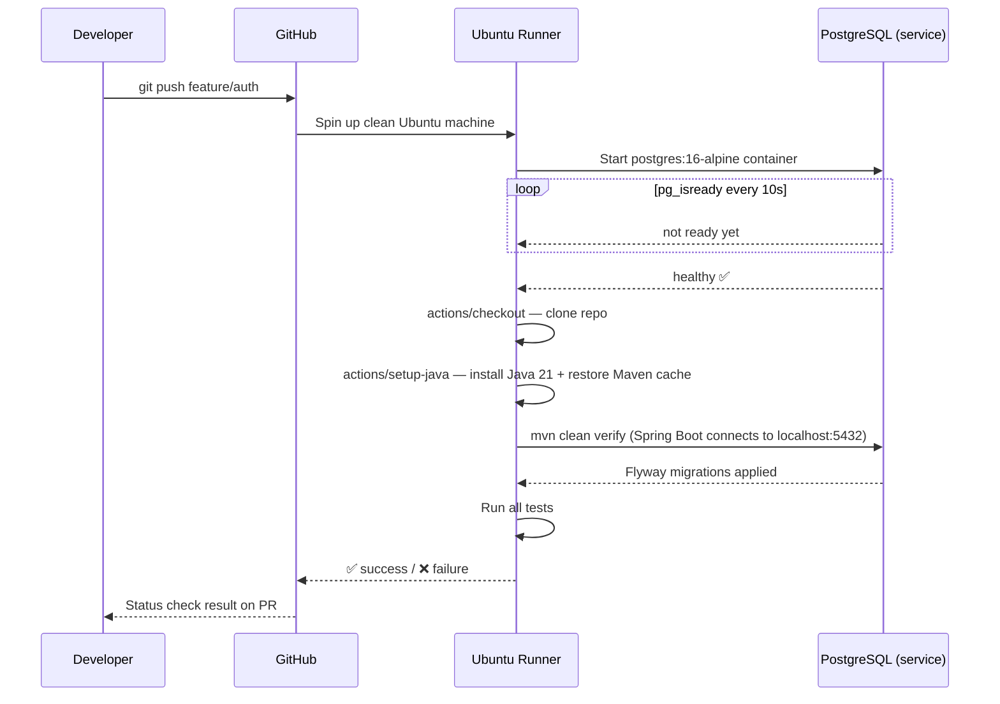
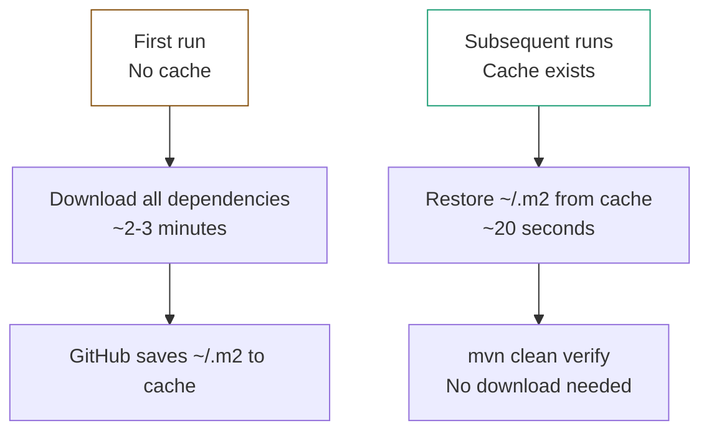
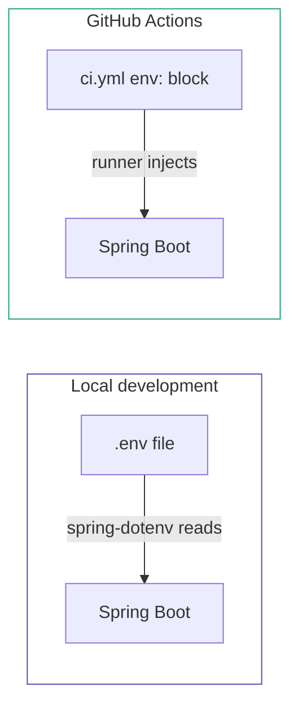
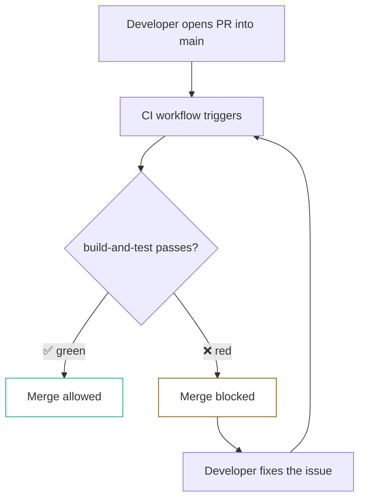

# GitHub Actions — CI

## What is CI

**CI (Continuous Integration)** — automatically validates code on every push. Builds the project, runs tests. If something breaks — it's visible immediately.

**Why it matters:**
- Broken code cannot reach `main`
- Every developer gets instant feedback on their changes
- Required status checks block merge until CI is green

---

## How It Works



---

## When CI Runs

```yaml
on:
  push:
    branches:
      - '**'        # any branch on push, including main
  pull_request:
    branches:
      - main        # when opening a PR into main
```

| Event | CI runs? |
|---|---|
| Push to `feature/auth` | ✅ |
| Push to `main` (after merge) | ✅ |
| Open PR into `main` | ✅ |
| Close PR without merge | ❌ |

---

## Workflow File — `ci.yml`

```yaml
name: CI

on:
  push:
    branches:
      - '**'
  pull_request:
    branches:
      - main

jobs:
  build-and-test:
    runs-on: ubuntu-latest

    services:
      postgres:
        image: postgres:16-alpine
        env:
          POSTGRES_DB: verdora_db
          POSTGRES_USER: postgres
          POSTGRES_PASSWORD: postgres
        ports:
          - 5432:5432
        options: >-
          --health-cmd "pg_isready -U postgres"
          --health-interval 10s
          --health-timeout 5s
          --health-retries 5

    steps:
      - name: Checkout code
        uses: actions/checkout@v4

      - name: Set up Java 21
        uses: actions/setup-java@v4
        with:
          java-version: '21'
          distribution: 'temurin'
          cache: maven

      - name: Build and test
        env:
          DB_DRIVER: org.postgresql.Driver
          DB_URL: jdbc:postgresql://localhost:5432/verdora_db
          DB_USERNAME: postgres
          DB_PASSWORD: postgres
          JWT_SECRET: test-secret-key-for-ci-at-least-32-chars!!
          GOOGLE_CLIENT_ID: test
          GOOGLE_CLIENT_SECRET: test
          REDIRECT_URL: http://localhost:5173
          SERVER_PORT: 8081
        run: mvn clean verify -B
```

---

## Line by Line

### `name` and `on`

`name: CI` — workflow name displayed on the Actions tab in GitHub.

`on` — defines what triggers the workflow. `'**'` is a wildcard matching any branch including `main`.

### `jobs`

```yaml
jobs:
  build-and-test:
    runs-on: ubuntu-latest
```

`build-and-test` — job name. This is the name you add as a required status check in Branch Protection Rules — merge is blocked until this job passes.

`runs-on: ubuntu-latest` — GitHub spins up a clean Ubuntu machine for every run. Free for public repositories. The machine is destroyed after the job completes.

### `services` — PostgreSQL for tests

```yaml
services:
  postgres:
    image: postgres:16-alpine
    ...
    options: >-
      --health-cmd "pg_isready -U postgres"
      --health-interval 10s
      --health-timeout 5s
      --health-retries 5
```

GitHub starts a PostgreSQL container on the runner machine alongside your code. Spring Boot connects to it via `localhost:5432` during tests.

`options: >-` — YAML syntax for a multiline string without line breaks. These options are passed as arguments to `docker run` — equivalent to `healthcheck` in `docker-compose` but in a different format.

The key difference from `docker-compose`:

| | `docker-compose` | GitHub Actions `services` |
|---|---|---|
| Healthcheck format | YAML block | `--health-cmd` option |
| DB host from app | `db:5432` (service name) | `localhost:5432` (runner network) |
| Purpose | Local development | CI environment |

In GitHub Actions, the service is available via `localhost` because the container and the runner share the same network.

### `steps`

```yaml
- name: Checkout code
  uses: actions/checkout@v4
```

Clones your repository onto the runner. Without this step — there is no code. `actions/checkout@v4` is an official GitHub action. `@v4` is the version tag.

```yaml
- name: Set up Java 21
  uses: actions/setup-java@v4
  with:
    java-version: '21'
    distribution: 'temurin'
    cache: maven
```

Installs Java 21 on the runner. `distribution: 'temurin'` — Eclipse Temurin (same as in the Dockerfile). `cache: maven` — caches `~/.m2` between runs. First run downloads all dependencies (~2-3 min), subsequent runs restore from cache (~20 sec). GitHub manages the cache automatically.

```yaml
- name: Build and test
  env:
    JWT_SECRET: test-secret-key-for-ci-at-least-32-chars!!
    GOOGLE_CLIENT_ID: test
    GOOGLE_CLIENT_SECRET: test
    ...
  run: mvn clean verify -B
```

`env` — environment variables for this step. Spring Boot reads them instead of `.env` (which doesn't exist on the runner).

`JWT_SECRET` is hardcoded here — this is fine for a test environment. Real secrets (`GOOGLE_CLIENT_ID`, etc.) are replaced with `test` because they are not used during tests.

`mvn clean verify -B` — builds the project and runs all tests:

| Command | What it does |
|---|---|
| `mvn clean package` | Builds JAR + runs unit tests |
| `mvn clean verify` | Builds JAR + runs unit tests + integration tests |

`-B` — batch mode, no interactive output or color — cleaner logs in CI.

If any test fails — the step fails, the job fails, merge is blocked.

---

## Maven Cache — How It Works



Cache is invalidated when `pom.xml` changes — dependencies are re-downloaded. This is the same logic as Docker layer caching.

---

## Environment Variables in CI vs Local



`.env` file is in `.gitignore` — it never reaches the runner. CI provides its own values directly in the workflow file. Real secrets (Google OAuth, JWT for production) go into **GitHub Secrets** — used in the CD workflow, not CI.

---

## Branch Protection Integration



In **Settings → Branches → Branch protection rules** the `build-and-test` job is added as a required status check. GitHub enforces this — no merge without green CI, even for repository owners.

---

## File Location

```
Verdora-backend/
├── .github/
│   └── workflows/
│       └── ci.yml    ← this file
├── src/
├── Dockerfile
├── docker-compose.yml
└── pom.xml
```
