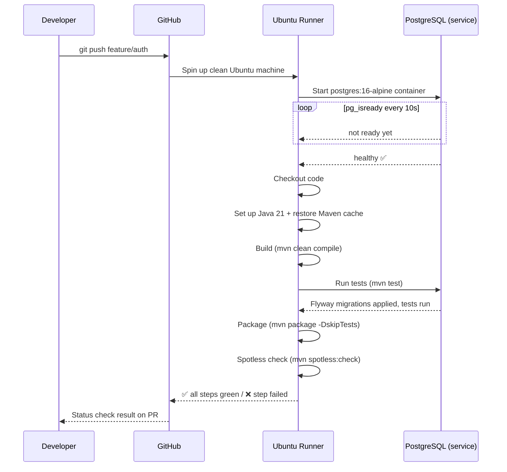
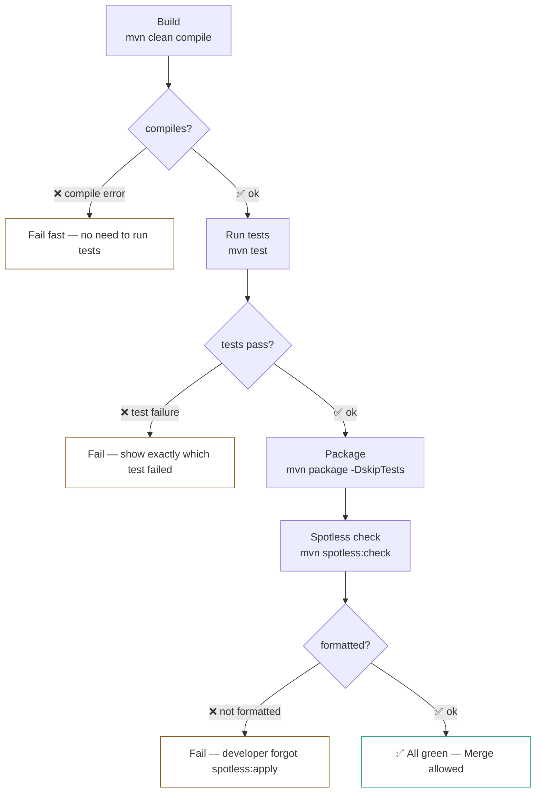
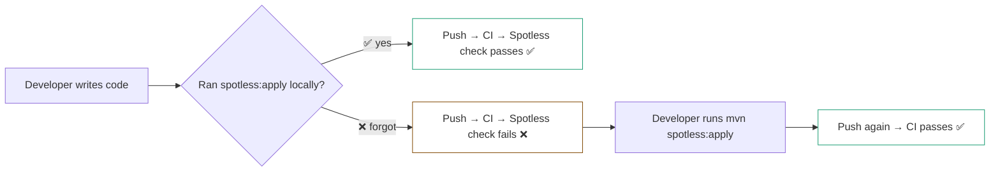
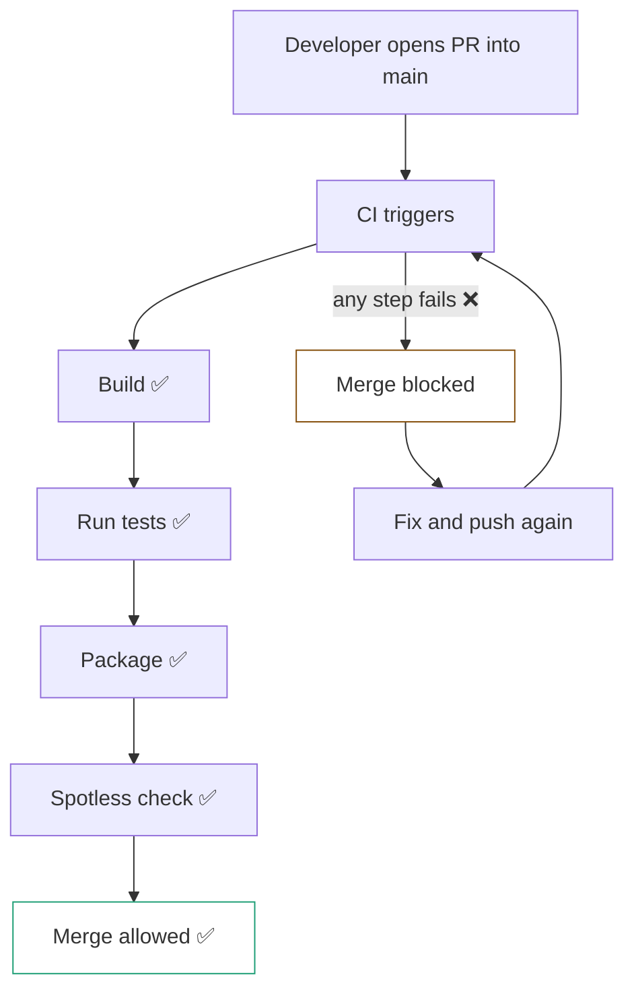

# GitHub Actions — CI

## What is CI

**CI (Continuous Integration)** — automatically validates code on every push. Builds the project, runs tests, checks formatting. If something breaks — it's visible immediately before it reaches `main`.

**Why it matters:**
- Broken code cannot reach `main`
- Formatting issues are caught automatically — no "I forgot to run spotless"
- Every developer gets instant feedback on their changes
- Required status checks block merge until CI is green

---

## How It Works



---

## When CI Runs

| Event | CI runs? |
|---|---|
| Push to `feature/auth` | ✅ |
| Push to `main` (after merge) | ✅ |
| Open PR into `main` | ✅ |
| Close PR without merge | ❌ |

---

## Workflow File — `ci.yml`

```yaml
name: CI

on:
  push:
    branches:
      - '**'
  pull_request:
    branches:
      - main

jobs:
  build-and-test:
    runs-on: ubuntu-latest

    env:
      DB_DRIVER: org.postgresql.Driver
      DB_URL: jdbc:postgresql://localhost:5432/verdora_db
      DB_USERNAME: postgres
      DB_PASSWORD: postgres
      JWT_SECRET: test-secret-key-for-ci-at-least-32-chars!!
      GOOGLE_CLIENT_ID: test
      GOOGLE_CLIENT_SECRET: test
      REDIRECT_URL: http://localhost:5173
      SERVER_PORT: 8081

    services:
      postgres:
        image: postgres:16-alpine
        env:
          POSTGRES_DB: verdora_db
          POSTGRES_USER: postgres
          POSTGRES_PASSWORD: postgres
        ports:
          - 5432:5432
        options: >-
          --health-cmd "pg_isready -U postgres"
          --health-interval 10s
          --health-timeout 5s
          --health-retries 5

    steps:
      - name: Checkout code
        uses: actions/checkout@v4

      - name: Set up Java 21
        uses: actions/setup-java@v4
        with:
          java-version: '21'
          distribution: 'temurin'
          cache: maven

      - name: Build
        run: mvn clean compile -B

      - name: Run tests
        run: mvn test -B

      - name: Package
        run: mvn package -DskipTests -B

      - name: Spotless check
        run: mvn spotless:check -B
```

---

## Steps Breakdown

### What you see in GitHub Actions UI

```
✅ Set up job              2s
✅ Initialize containers   20s   ← PostgreSQL healthcheck
✅ Checkout code           1s
✅ Set up Java 21          0s    ← restored from cache
✅ Build                   15s   ← mvn clean compile
✅ Run tests               25s   ← mvn test + Flyway + Spring context
✅ Package                 10s   ← mvn package -DskipTests
✅ Spotless check          5s    ← mvn spotless:check
✅ Complete job            0s
```

### Why separate steps matter



---

## `env` at Job Level

`env` defined at the **job level** is automatically available to all steps — no need to repeat it in every step. Spring Boot reads these variables instead of `.env` (which doesn't exist on the runner).

`JWT_SECRET` is hardcoded — fine for tests. `GOOGLE_CLIENT_ID: test` — placeholder because OAuth2 is not tested in CI.

---

## Spotless in CI — Why It Matters



`spotless:check` does **not** modify files — it only checks. If any file is not formatted — the step fails with a clear message.

---

## Branch Protection Integration



---

## File Location

```
Verdora-backend/
├── .github/
│   └── workflows/
│       ├── ci.yml    ← this file
│       └── cd.yml
├── src/
├── Dockerfile
└── pom.xml
```
