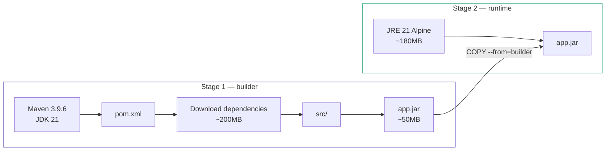
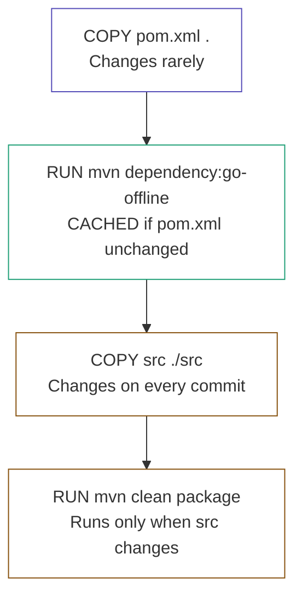
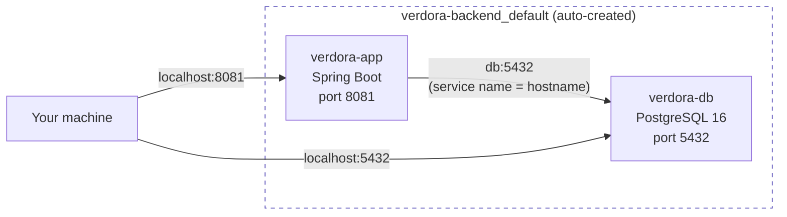
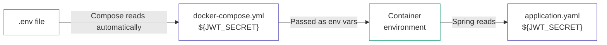
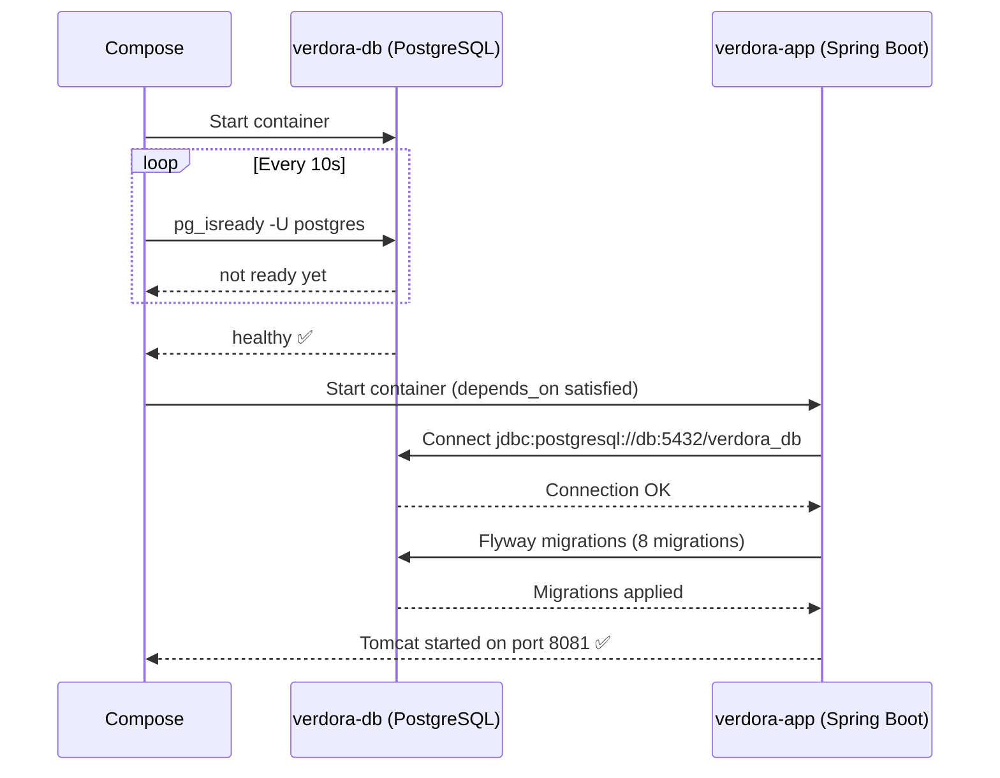
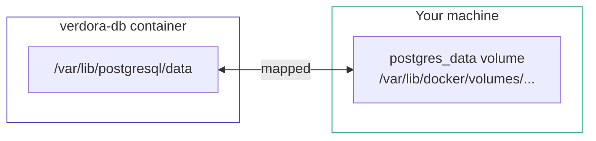

# Docker

## What is Docker and Why

**The problem without Docker:**

> "It works on my machine" — classic situation where your machine has Java 21 but the server has Java 17, or a different PostgreSQL version, or different environment variables.

**Docker solves this** — it packages the application together with everything it needs (Java, dependencies, configs) into a single **container**. The container runs identically on any machine.

**Analogy:**
- `Dockerfile` — a recipe
- `Image` — the finished dish made from the recipe
- `Container` — the dish served on the table (running instance)

---

## Dockerfile

A Dockerfile is an instruction set for building an image. Every line creates a separate **layer**. Docker caches each layer — if nothing changed, it reuses the cache instead of rebuilding.

### Multi-stage Build

Instead of one large image with Maven + JDK + source code, we use two stages:



**Result:** final image ~180MB instead of ~600MB. No source code, no Maven, nothing unnecessary.

### Dockerfile Line by Line

```dockerfile
# Stage 1 — build
FROM maven:3.9.6-eclipse-temurin-21 AS builder
WORKDIR /app
COPY pom.xml .
RUN mvn dependency:go-offline -B
COPY src ./src
RUN mvn clean package -DskipTests -B

# Stage 2 — runtime
FROM eclipse-temurin:21-jre-alpine
WORKDIR /app
COPY --from=builder /app/target/*.jar app.jar
EXPOSE 8081
ENTRYPOINT ["java", "-jar", "app.jar"]
```

**Stage 1:**

| Line | What it does |
|---|---|
| `FROM maven:3.9.6-eclipse-temurin-21 AS builder` | Base image with Maven + Java 21. `AS builder` gives this stage a name to reference later |
| `WORKDIR /app` | Creates `/app` folder and sets it as the working directory for all subsequent commands |
| `COPY pom.xml .` | Copies only `pom.xml` first — the key caching trick |
| `RUN mvn dependency:go-offline -B` | Downloads all dependencies. Cached if `pom.xml` didn't change |
| `COPY src ./src` | Copies source code. Done after dependencies for caching reasons |
| `RUN mvn clean package -DskipTests -B` | Builds the JAR. `-DskipTests` — tests run separately in CI |

**Stage 2:**

| Line | What it does |
|---|---|
| `FROM eclipse-temurin:21-jre-alpine` | Clean image with JRE only (not JDK). `alpine` = minimal Linux ~5MB |
| `WORKDIR /app` | Working directory in the new image |
| `COPY --from=builder /app/target/*.jar app.jar` | Copies only the JAR from Stage 1. Nothing else transfers |
| `EXPOSE 8081` | Documents that the app listens on port 8081. Does **not** open the port automatically |
| `ENTRYPOINT ["java", "-jar", "app.jar"]` | Command executed on container start. Array form (exec) runs without shell — important for graceful shutdown |

### Layer Caching — Why Order Matters



If we copied `src` first — every change to any `.java` file would invalidate the cache and re-download all dependencies (~3 minutes). With the correct order — only `COPY src` and `mvn package` re-execute, dependencies come from cache (~15 seconds).

### Build Commands

```bash
# Build the image
docker build -t verdora-backend .

# Run a single container
docker run -p 8081:8081 --env-file .env verdora-backend
```

`-p 8081:8081` — maps port from container to host machine (`host:container`).
`--env-file .env` — passes environment variables from `.env` file.

---

## Docker Compose

### What and Why

`docker build` + `docker run` works for a single container. But the application needs both Spring Boot and PostgreSQL — they must know about each other and start in the right order. `docker-compose` orchestrates multiple containers together.

### How Containers Communicate



`localhost` inside a container refers to the container itself — not your machine and not another container. Compose creates a shared network and registers each service by its name. That's why `db:5432` works — `db` is the DNS name that resolves to the `verdora-db` container IP within the network.

### docker-compose.yml Line by Line

```yaml
services:

  db:
    image: postgres:16-alpine
    container_name: verdora-db
    environment:
      POSTGRES_DB: verdora_db
      POSTGRES_USER: postgres
      POSTGRES_PASSWORD: postgres
    ports:
      - "5432:5432"
    volumes:
      - postgres_data:/var/lib/postgresql/data
    healthcheck:
      test: [ "CMD-SHELL", "pg_isready -U postgres" ]
      interval: 10s
      timeout: 5s
      retries: 5

  app:
    build: ..
    container_name: verdora-app
    depends_on:
      db:
        condition: service_healthy
    healthcheck:
      test: [ "CMD", "wget", "--spider", "-q", "http://localhost:8081/health/ping" ]
      interval: 30s
      timeout: 10s
      retries: 3
      start_period: 40s
    environment:
      DB_DRIVER: org.postgresql.Driver
      DB_URL: jdbc:postgresql://db:5432/verdora_db
      DB_USERNAME: postgres
      DB_PASSWORD: postgres
      JWT_SECRET: ${JWT_SECRET}
      GOOGLE_CLIENT_ID: ${GOOGLE_CLIENT_ID}
      GOOGLE_CLIENT_SECRET: ${GOOGLE_CLIENT_SECRET}
      REDIRECT_URL: ${REDIRECT_URL}
    ports:
      - "8081:8081"

volumes:
  postgres_data:
```

**`db` service:**

| Key | What it does |
|---|---|
| `image: postgres:16-alpine` | Uses a ready-made image from Docker Hub instead of building one |
| `environment` | PostgreSQL reads these on first start and creates the database and user automatically |
| `ports: "5432:5432"` | Exposes the port to your machine. Needed for connecting from IntelliJ/DBeaver. Not needed for container-to-container communication |
| `volumes` | Maps `/var/lib/postgresql/data` (where PostgreSQL stores data inside the container) to a named volume. Without this — all data is lost on `docker-compose down` |
| `healthcheck` | Checks if PostgreSQL is ready to accept connections using `pg_isready`. `CMD-SHELL` runs via shell |

**`app` service:**

| Key | What it does |
|---|---|
| `build: .` | Builds image from `Dockerfile` in current directory instead of pulling from registry |
| `depends_on: condition: service_healthy` | Waits until `db` passes healthcheck before starting. Without `condition` — only waits for container start, not database readiness |
| `healthcheck` | Checks that Spring Boot is alive via `/health/ping`. `start_period: 40s` gives the app time to boot before counting failures |
| `environment: DB_URL` | `db` is the service name — Compose resolves it to the container IP inside the network |
| `${JWT_SECRET}` | Compose automatically reads `.env` file and substitutes values |


### `depends_on` — Startup Conditions

`depends_on` controls when a service starts relative to another. There are three possible `condition` values:

| Condition | When `app` starts |
|---|---|
| `service_started` | Container has started (default — does **not** guarantee the DB is ready) |
| `service_healthy` | Container has passed healthcheck — DB is accepting connections ✅ |
| `service_completed_successfully` | Container finished with exit code 0 (for one-time tasks like migrations) |

Without `condition: service_healthy` — race condition is guaranteed on first startup when PostgreSQL is still initializing data.
### Environment Variables Flow



### Startup Sequence



### Docker Compose Commands

```bash
docker-compose up --build    # build and start
docker-compose up -d         # start in background (detached)
docker-compose down          # stop and remove containers
docker-compose down -v       # stop and remove containers + volumes (deletes DB data)
docker-compose logs -f app   # stream logs from app container
docker-compose ps            # list running containers and their status
```

### Volumes



Named volumes are declared at the bottom of `docker-compose.yml`:

```yaml
volumes:
  postgres_data:
```

Docker manages the physical location on the host. Data persists across container restarts — only `docker-compose down -v` removes it.

---

## Summary

| | `docker build` + `docker run` | `docker-compose` |
|---|---|---|
| Single container | ✅ | ✅ |
| Multiple containers | ❌ manual | ✅ automatic |
| Network between containers | ❌ manual | ✅ automatic |
| Startup order | ❌ manual | ✅ `depends_on` |
| Healthchecks | ❌ manual | ✅ built-in |
| Environment from `.env` | ❌ manual | ✅ automatic |
