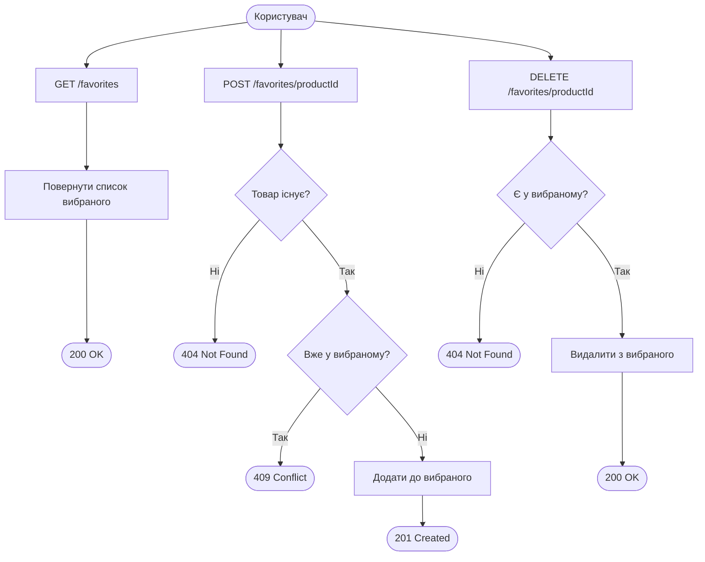
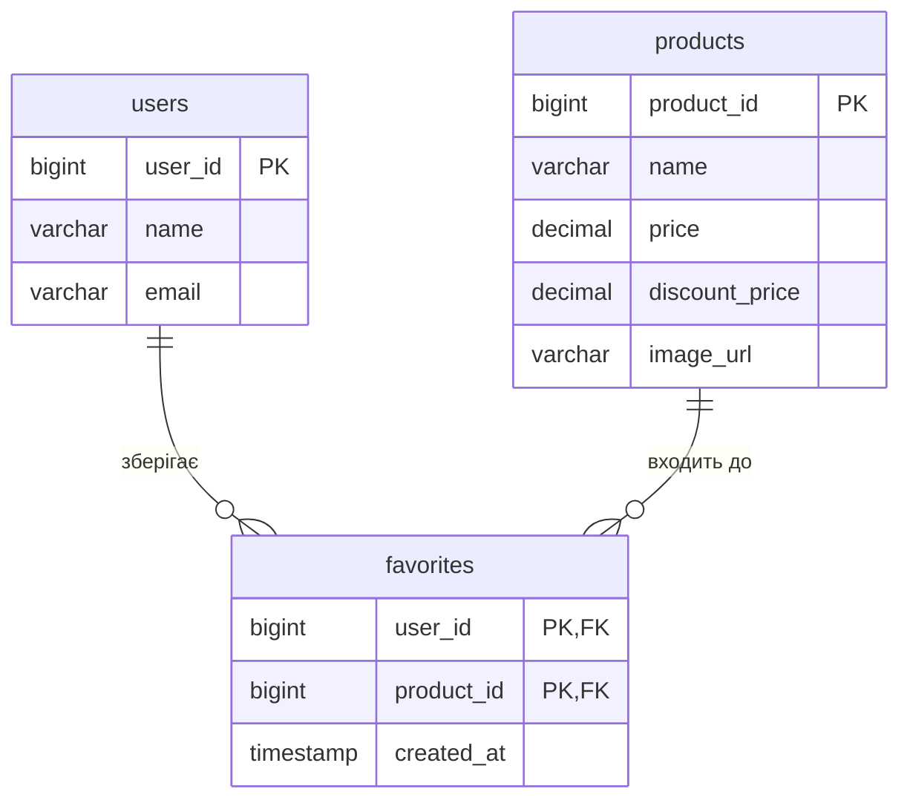

# Favorites API

Вибране — список товарів які користувач зберіг для себе. Реалізовано через зв'язок many-to-many між `users` і `products` з composite primary key `(user_id, product_id)`.

---

## Ендпоінти

| Метод | URL | Опис |
|---|---|---|
| GET | `/favorites` | Список вибраного |
| POST | `/favorites/{productId}` | Додати в обране |
| DELETE | `/favorites/{productId}` | Видалити з обраного |

Всі ендпоінти потребують автентифікації (`accessToken` cookie).

---

## GET /favorites

Повертає всі товари у вибраному поточного користувача.

**Response 200:**
```json
{
  "timestamp": "2026-05-23T12:00:00Z",
  "status": 200,
  "message": "Favorites fetched successfully",
  "data": [
    {
      "productId": 1,
      "productName": "Ноутбук ASUS VivoBook 15",
      "imageUrl": "https://picsum.photos/seed/p1/400/300",
      "price": 32999.99,
      "discountPrice": 27999.99,
      "addedAt": "2026-05-20T10:00:00Z"
    },
    {
      "productId": 3,
      "productName": "Смартфон Samsung Galaxy A55",
      "imageUrl": "https://picsum.photos/seed/p3/400/300",
      "price": 18999.00,
      "discountPrice": 18999.00,
      "addedAt": "2026-05-21T14:30:00Z"
    }
  ]
}
```

---

## POST /favorites/{productId}

Додає товар до вибраного. Якщо товар вже є — повертає 409.

**Response 201:**
```json
{
  "status": 201,
  "message": "Added to favorites",
  "data": {
    "productId": 5,
    "productName": "Куртка Adidas Windbreaker",
    "imageUrl": "https://picsum.photos/seed/p5/400/300",
    "price": 2499.00,
    "discountPrice": 2499.00,
    "addedAt": "2026-05-23T12:00:00Z"
  }
}
```

**Response 404** — товар не знайдено:
```json
{
  "status": 404,
  "message": "Product not found, id=99"
}
```

**Response 409** — товар вже у вибраному:
```json
{
  "status": 409,
  "message": "Product already in favorites, productId=5"
}
```

---

## DELETE /favorites/{productId}

Видаляє товар з вибраного.

**Response 200:**
```json
{
  "status": 200,
  "message": "Removed from favorites",
  "data": null
}
```

**Response 404** — товару немає у вибраному:
```json
{
  "status": 404,
  "message": "Product not found in favorites, productId=99"
}
```

---

## Структура відповіді

### FavoriteResponse
| Поле | Тип | Опис |
|---|---|---|
| `productId` | Long | ID товару |
| `productName` | String | Назва товару |
| `imageUrl` | String | URL зображення |
| `price` | BigDecimal | Поточна ціна |
| `discountPrice` | BigDecimal | Ціна зі знижкою |
| `addedAt` | OffsetDateTime | Дата додавання в обране |

---

## Бізнес-логіка

- Один юзер не може додати один і той самий товар двічі — повертає **409 CONFLICT**
- Видалення неіснуючого запису у вибраному — повертає **404 NOT FOUND**
- Composite PK `(user_id, product_id)` гарантує унікальність на рівні БД
- При видаленні юзера або товару — запис у вибраному видаляється автоматично (`ON DELETE CASCADE`)

---

## Діаграма флоу



---

## Діаграма БД


