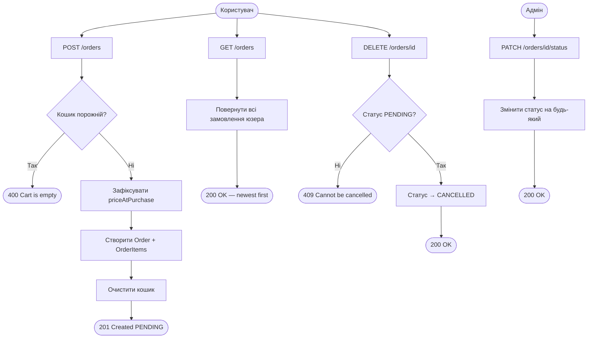
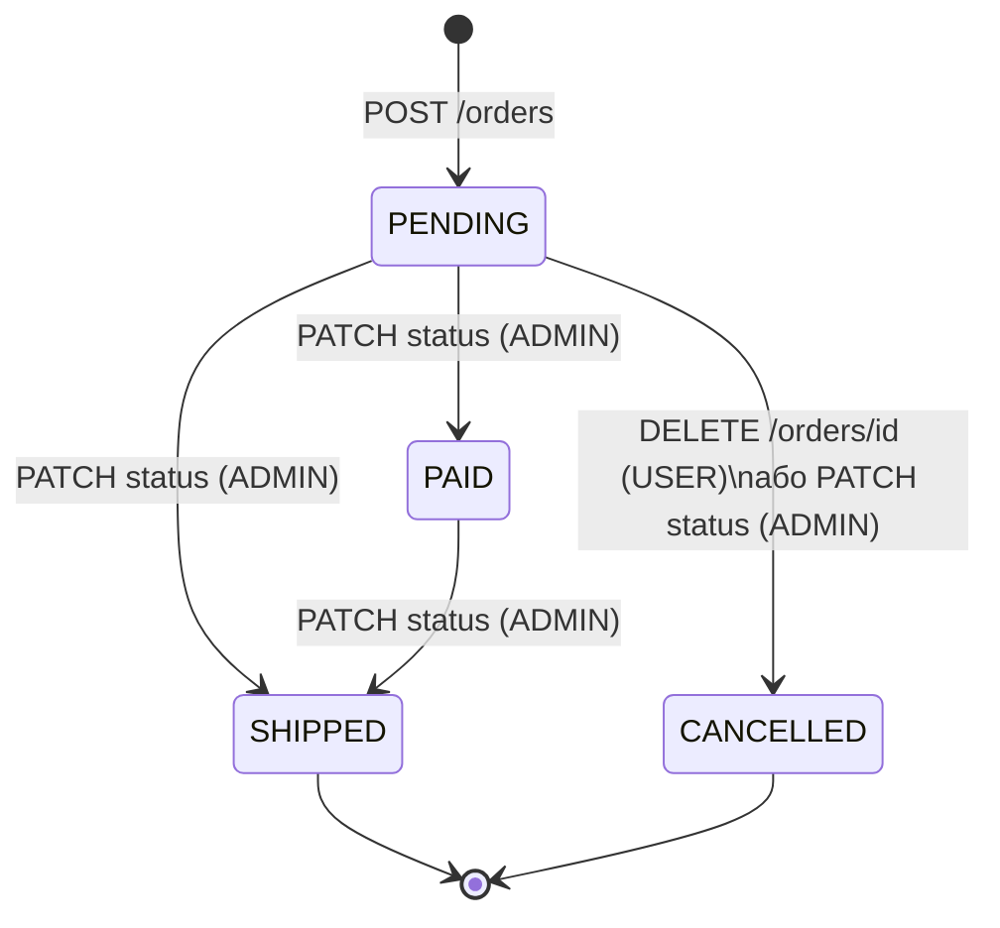
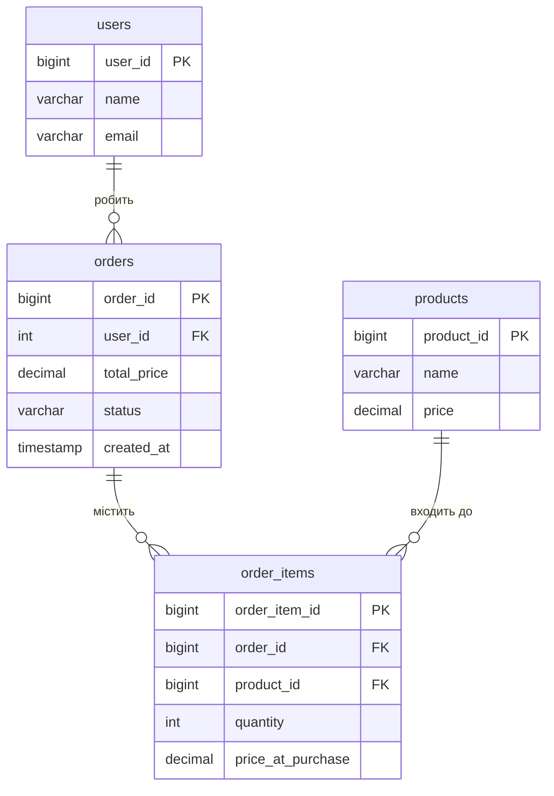

# Orders API

Замовлення створюється з поточного кошика. Ціни фіксуються на момент оформлення. Після успішного замовлення кошик очищається.

---

## Статуси замовлення

| Статус | Опис |
|---|---|
| `PENDING` | Щойно оформлено, очікує обробки |
| `PAID` | Оплачено |
| `SHIPPED` | Відправлено |
| `CANCELLED` | Скасовано |

Скасувати можна лише замовлення зі статусом `PENDING`. Змінювати статус вручну може тільки **ADMIN**.

---

## Ендпоінти

| Метод | URL | Роль | Опис |
|---|---|---|---|
| POST | `/orders` | USER | Оформити замовлення |
| GET | `/orders` | USER | Список своїх замовлень |
| GET | `/orders/{orderId}` | USER | Деталі замовлення |
| DELETE | `/orders/{orderId}` | USER | Скасувати замовлення |
| PATCH | `/orders/{orderId}/status` | ADMIN | Змінити статус |

Всі ендпоінти потребують автентифікації (`accessToken` cookie).

---

## POST /orders

Оформлює замовлення з поточного кошика. Кошик очищається після успішного створення.

**Response 201:**
```json
{
  "timestamp": "2026-05-23T12:00:00Z",
  "status": 201,
  "message": "Order placed successfully",
  "data": {
    "orderId": 1,
    "status": "PENDING",
    "totalPrice": 45498.99,
    "items": [
      {
        "orderItemId": 1,
        "productId": 1,
        "productName": "Ноутбук ASUS VivoBook 15",
        "quantity": 1,
        "priceAtPurchase": 32999.99,
        "subtotal": 32999.99
      },
      {
        "orderItemId": 2,
        "productId": 2,
        "productName": "Навушники Sony WH-1000XM5",
        "quantity": 1,
        "priceAtPurchase": 12499.00,
        "subtotal": 12499.00
      }
    ],
    "createdAt": "2026-05-23T12:00:00Z"
  }
}
```

**Response 400** — кошик порожній:
```json
{
  "status": 400,
  "message": "Cannot place order: cart is empty"
}
```

---

## GET /orders

Повертає всі замовлення поточного користувача, відсортовані від найновіших.

**Response 200** — масив замовлень (структура як у POST /orders)

---

## GET /orders/{orderId}

Повертає конкретне замовлення. Юзер може бачити тільки свої замовлення.

**Response 200** — замовлення (структура як у POST /orders)

**Response 404** — замовлення не знайдено:
```json
{
  "status": 404,
  "message": "Order not found, id=99"
}
```

---

## DELETE /orders/{orderId}

Скасовує замовлення. Можливо тільки якщо статус `PENDING`.

**Response 200** — повертає оновлене замовлення зі статусом `CANCELLED`

**Response 404** — замовлення не знайдено

**Response 409** — замовлення не можна скасувати:
```json
{
  "status": 409,
  "message": "Order cannot be cancelled, id=1. Only PENDING orders can be cancelled"
}
```

---

## PATCH /orders/{orderId}/status

Змінює статус замовлення. Тільки для **ADMIN**.

**Request body:**
```json
{
  "status": "SHIPPED"
}
```

**Допустимі значення:** `PENDING`, `PAID`, `SHIPPED`, `CANCELLED`

**Response 200** — повертає оновлене замовлення

**Response 403** — якщо не ADMIN

**Response 404** — замовлення не знайдено

---

## Структура відповіді

### OrderResponse
| Поле | Тип | Опис |
|---|---|---|
| `orderId` | Long | ID замовлення |
| `status` | OrderStatus | Статус |
| `totalPrice` | BigDecimal | Загальна сума |
| `items` | List | Список товарів |
| `createdAt` | OffsetDateTime | Дата створення |

### OrderItemResponse
| Поле | Тип | Опис |
|---|---|---|
| `orderItemId` | Long | ID елемента замовлення |
| `productId` | Long | ID товару |
| `productName` | String | Назва товару на момент покупки |
| `quantity` | Integer | Кількість |
| `priceAtPurchase` | BigDecimal | Ціна на момент покупки |
| `subtotal` | BigDecimal | priceAtPurchase × quantity |

---

## Бізнес-логіка

- `priceAtPurchase` фіксується з поточної ціни товару **на момент оформлення** — якщо ціна зміниться пізніше, це не вплине на замовлення
- Після `POST /orders` кошик **очищається автоматично**
- Юзер бачить **тільки свої** замовлення — чужий `orderId` повертає 404
- Скасувати можна тільки `PENDING` замовлення — решта повертає 409
- Список замовлень відсортований **від найновіших** (`ORDER BY created_at DESC`)

---

## Діаграма флоу



## Діаграма статусів замовлення



## Діаграма БД


